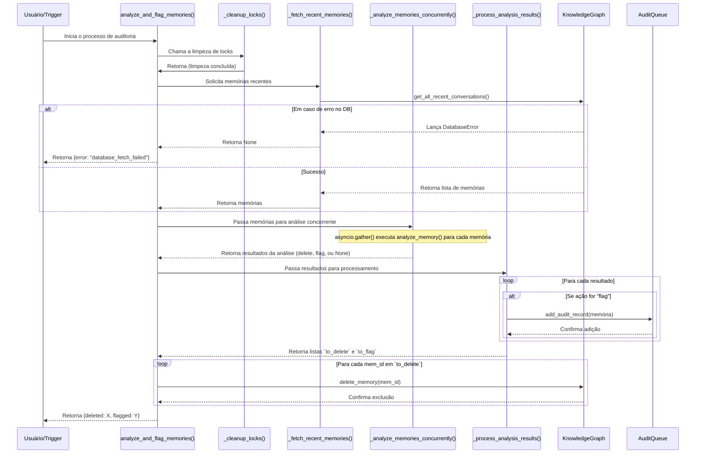
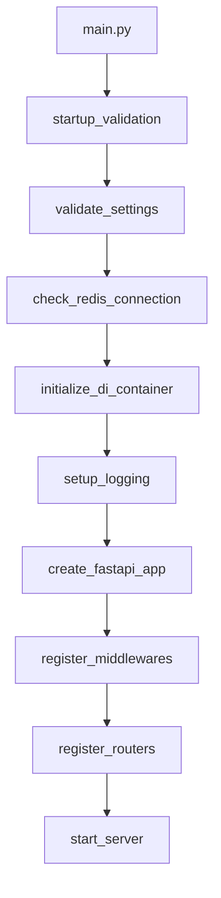

# Arquitetura do Sistema Resync

## 1. Visão Geral

O projeto **Resync** é um assistente de IA projetado para atuar no ecossistema de desenvolvimento de software, com foco em depuração, correção de más práticas e melhoria da estabilidade geral do código. A aplicação é construída utilizando o framework **FastAPI**, o que a torna uma solução moderna e de alta performance para a criação de APIs.

A arquitetura do projeto é modular, separando as responsabilidades em diretórios bem definidos, como `api`, `core`, e `services`. O sistema utiliza injeção de dependências para gerenciar os serviços e garantir um baixo acoplamento entre os componentes. Além disso, a aplicação conta com um robusto processo de inicialização, que inclui validação de configurações, checagem de dependências (como a conexão com o Redis) e health checks de serviços críticos.

A arquitetura foi projetada com os seguintes princípios em mente:
- **Desacoplamento:** Os componentes são independentes e se comunicam através de interfaces bem definidas.
- **Testabilidade:** O uso de Injeção de Dependência (DI) permite testes unitários e de integração eficazes.
- **Escalabilidade:** A arquitetura suporta comunicação assíncrona e concorrência, preparada para ambientes de alta carga.
- **Robustez:** Tratamento de erros específico, retentativas (retry) e padrões como Circuit Breaker garantem a estabilidade do sistema.

## 2. Componentes Principais

O sistema é dividido em várias camadas e módulos, cada um com uma responsabilidade clara.

```mermaid
graph TD
    subgraph "Camada de Apresentação (UI)"
        UI_Chat[Chatbot Frontend]
        UI_Dashboard[Dashboard]
        UI_Review[Interface de Revisão Humana]
    end

    subgraph "Camada de API (FastAPI)"
        API_Main[main.py]
        API_Chat[chat.py]
        API_Endpoints[endpoints.py]
        API_Audit[audit.py]
    end

    subgraph "Camada de Core (Lógica de Negócio)"
        Core_DI[DI Container]
        Core_AgentManager[AgentManager]
        Core_KnowledgeGraph[KnowledgeGraph]
        Core_IAAuditor[IA Auditor]
        Core_AuditQueue[AuditQueue (Redis)]
        Core_ConnectionManager[ConnectionManager]
    end

    subgraph "Camada de Serviços e Dados"
        Service_TWS[TWS Service]
        Service_LLM[LLM Service]
        Data_Settings[Settings]
        Data_AgentsJSON[agents.json]
        DB_Neo4j[Neo4j]
        DB_Redis[Redis]
    end

    UI_Chat --> API_Chat
    UI_Dashboard --> API_Endpoints
    UI_Review --> API_Audit

    API_Main --> Core_DI
    API_Chat --> Core_ConnectionManager
    API_Chat --> Core_AgentManager
    API_Audit --> Core_AuditQueue

    Core_AgentManager --> Service_TWS
    Core_AgentManager --> Data_AgentsJSON
    Core_IAAuditor --> Core_KnowledgeGraph
    Core_IAAuditor --> Core_AuditQueue
    Core_KnowledgeGraph --> Service_LLM
    Core_KnowledgeGraph --> DB_Neo4j
    Core_AuditQueue --> DB_Redis
```

### 2.1. Camada de API (FastAPI)

- **`resync/main.py`**: Ponto de entrada da aplicação. Configura o servidor FastAPI, o ciclo de vida da aplicação (`lifespan`), e registra os roteadores.
- **`resync/api/`**: Contém os endpoints da API.
  - **`endpoints.py`**: Endpoints gerais, como health checks (`/health`), métricas (`/metrics`) e o dashboard principal.
  - **`chat.py`**: Endpoint principal do WebSocket (`/ws/{agent_id}`) que gerencia a comunicação em tempo real com os agentes de IA.
  - **`audit.py`**: Endpoints para a interface de revisão humana, permitindo a aprovação ou rejeição de memórias sinalizadas.

### 2.2. Camada de Core (Lógica de Negócio)

- **`resync/core/di_container.py`**: Implementa um container de Injeção de Dependência que gerencia o ciclo de vida de todos os serviços principais.
- **`resync/core/interfaces.py`**: Define os contratos (interfaces abstratas) para os serviços, como `IAgentManager`, `IKnowledgeGraph`, etc.
- **`resync/core/agent_manager.py`**: Responsável por carregar as configurações dos agentes, criar instâncias de agentes de IA (usando a biblioteca `agno`) e gerenciar suas ferramentas.
- **`resync/core/knowledge_graph.py`**: Abstrai a comunicação com o banco de dados vetorial (Neo4j). É responsável por armazenar e recuperar conversas, permitindo o aprendizado contínuo.
- **`resync/core/ia_auditor.py`**: Um dos componentes mais críticos. É um serviço de background que analisa proativamente as conversas armazenadas no `KnowledgeGraph` para garantir a qualidade da base de conhecimento.
- **`resync/core/audit_queue.py`**: Fila baseada em Redis que armazena memórias sinalizadas pelo `IAAuditor` para revisão humana.
- **`resync/core/audit_lock.py`**: Implementa um lock distribuído usando Redis para evitar que múltiplos processos do `IAAuditor` analisem a mesma memória simultaneamente.
- **`resync/core/connection_manager.py`**: Gerencia todas as conexões WebSocket ativas, permitindo o broadcast de mensagens.
- **`resync/core/exceptions.py`**: Define uma hierarquia de exceções customizadas para um tratamento de erros mais granular.

### 2.3. Camada de Serviços (Integrações Externas)

- **`resync/services/tws_service.py`**: Cliente otimizado para comunicação com a API do HWA/TWS. Inclui pooling de conexões, retentativas com backoff exponencial e caching.
- **`resync/core/utils/llm.py`**: Utilitário para comunicação com os modelos de linguagem (LLMs), abstraindo a lógica de chamada de API.

### 2.4. Camada de Dados e Configuração

- **`resync/settings.py`**: Carrega e valida as configurações da aplicação a partir de variáveis de ambiente e arquivos `.env`.
- **`agents.json`**: Arquivo de configuração que define a personalidade, ferramentas e modelos para cada agente de IA.

### 2.5. Padrões Arquiteturais Avançados

#### CQRS (Command Query Responsibility Segregation)
A aplicação utiliza o padrão CQRS para separar as operações de leitura (Queries) das de escrita (Commands), otimizando cada tipo de operação:

- **Commands** (`resync/cqrs/commands.py`): Operações de escrita como criação, atualização e exclusão
- **Queries** (`resync/cqrs/queries.py`): Operações de leitura otimizadas
- **Handlers** (`resync/cqrs/command_handlers.py`, `resync/cqrs/query_handlers.py`): Implementações específicas

#### Injeção de Dependências Avançada
O sistema utiliza um container de DI sofisticado que gerencia:
- Ciclo de vida dos serviços (Singleton, Transient, Scoped)
- Resolução automática de dependências
- Configuração condicional baseada no ambiente

## 3. Tecnologias Utilizadas

- **Framework:** FastAPI
- **Servidor ASGI:** Uvicorn
- **Gerenciamento de Configuração:** Dynaconf
- **Cache:** Redis
- **Banco de Dados Vetorial:** Neo4j
- **Análise de Código:**
  - `pydeps` para análise de dependências
  - `mypy` para checagem de tipos
  - `pylint` para análise de qualidade de código

## 4. Fluxo de Dados Principais

### 4.1. Fluxo de Chat do Usuário

1.  O usuário se conecta ao endpoint WebSocket (`/ws/{agent_id}`).
2.  O `ConnectionManager` aceita e armazena a conexão.
3.  O `AgentManager` recupera o agente de IA solicitado.
4.  O usuário envia uma mensagem (pergunta).
5.  O `websocket_endpoint` recebe a mensagem.
6.  Ele consulta o `KnowledgeGraph` (`get_relevant_context`) para obter contexto de problemas passados (RAG).
7.  A pergunta do usuário e o contexto são enviados para o agente de IA.
8.  O agente processa a informação e, se necessário, utiliza suas ferramentas (ex: `tws_status_tool`) para consultar o `tws_service`.
9.  A resposta do agente é transmitida (streamed) de volta ao usuário via WebSocket.
10. A conversa completa (pergunta, resposta, contexto) é salva no `KnowledgeGraph` através do método `add_conversation`.
11. Uma tarefa em background (`run_auditor_safely`) é disparada para invocar o `IAAuditor`.

### 4.2. Fluxo do IA Auditor

Este fluxo é crucial para a auto-melhoria do sistema. Ele é executado em background após as interações do usuário.



**Descrição do Fluxo do Auditor:**

1.  **`analyze_and_flag_memories`** é o orquestrador principal.
2.  **`_cleanup_locks`**: Garante que nenhum lock expirado de execuções anteriores permaneça no Redis.
3.  **`_fetch_recent_memories`**: Busca as conversas mais recentes do `KnowledgeGraph` que ainda não foram auditadas.
4.  **`_analyze_memories_concurrently`**: Dispara a análise de múltiplas memórias em paralelo usando `asyncio.gather()`.
    -   Cada chamada a `analyze_memory` adquire um lock distribuído (`audit_lock`) para a memória específica, prevenindo que outra tarefa a analise ao mesmo tempo.
    -   A função `_get_llm_analysis` é chamada, enviando a conversa para um LLM auditor com um prompt específico para avaliar a correção da resposta.
5.  **`_process_analysis_results`**: Processa os resultados da análise do LLM.
    -   Se uma memória for considerada incorreta com alta confiança, ela é adicionada à lista `to_delete`.
    -   Se for incorreta com confiança média, é adicionada à lista `to_flag` e enviada para a `AuditQueue` (Redis) para revisão humana.
6.  **Ações Finais**: As memórias na lista `to_delete` são removidas do `KnowledgeGraph`.

### 4.3. Fluxo de Inicialização



## 5. Análise de Qualidade e Melhorias

### 5.1. Resultados das Ferramentas de Análise

#### pydeps (Análise de Dependências)
O grafo de dependências revelou uma arquitetura densamente conectada, com acoplamento significativo entre módulos. A complexidade sugere desafios na manutenção e evolução do código.

#### mypy (Checagem de Tipos)
Foram identificados **1962 erros em 242 arquivos**, indicando baixa adesão à tipagem estática. Problemas incluem ausência de anotações de tipo e uso incorreto de tipos.

#### pylint (Análise de Qualidade)
Nota obtida: **8.26/10**. Principais problemas:
- **Complexidade Elevada:** Módulos como `app_factory.py` e `tws_service.py` com alta complexidade ciclomática
- **Falta de Documentação:** Ausência generalizada de docstrings
- **Má Práticas:** Captura de exceções genéricas, variáveis não utilizadas
- **Problemas Arquiteturais:** Importações cíclicas detectadas

### 5.2. Pontos Fortes

- **Arquitetura Moderna:** Uso de FastAPI e design modular
- **Robustez na Inicialização:** Processo "fail-fast" garante estado consistente
- **Injeção de Dependências:** Facilita testes e manutenção
- **Padrões Arquiteturais:** Implementação adequada de CQRS e DI

### 5.3. Áreas de Melhoria

- **Redução de Complexidade:** Refatorar módulos de alta complexidade
- **Adoção de Tipagem Estática:** Corrigir erros reportados pelo mypy
- **Documentação:** Adicionar docstrings em todas as funções públicas
- **Resolução de Importações Cíclicas:** Refatorar módulos para eliminar dependências circulares
- **Tratamento de Exceções:** Substituir exceções genéricas por tipos específicos

## 6. Padrões de Design Utilizados

- **Injeção de Dependência (DI):** Centralizado no `DIContainer`, desacopla os componentes.
- **Princípio da Responsabilidade Única (SRP):** Funções como `analyze_and_flag_memories` foram refatoradas em funções menores e focadas.
- **Interfaces (Protocolos):** Usado para definir contratos claros entre os serviços.
- **Factory Pattern:** Usado para criar instâncias de serviços e configurações.
- **Cache Hierárquico (L1/L2):** Combina um cache em memória (`L1Cache`) com um cache distribuído (`Redis`) para otimizar a performance.
- **Circuit Breaker:** Implementado no cliente TWS para evitar falhas em cascata.
- **Singleton (Controlado):** O container de DI gerencia serviços com escopo `SINGLETON`, garantindo uma única instância quando necessário.