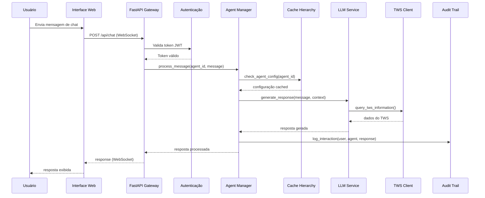
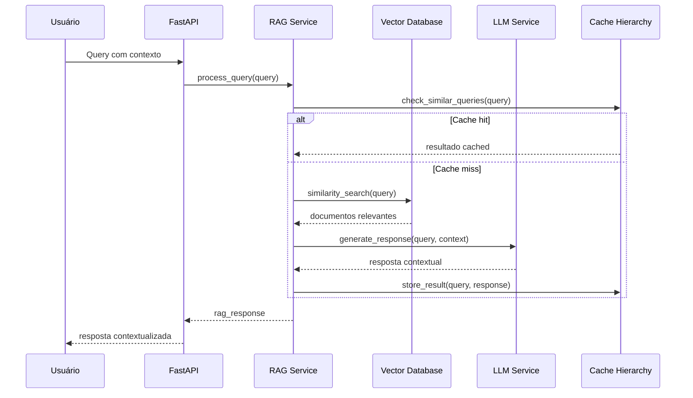
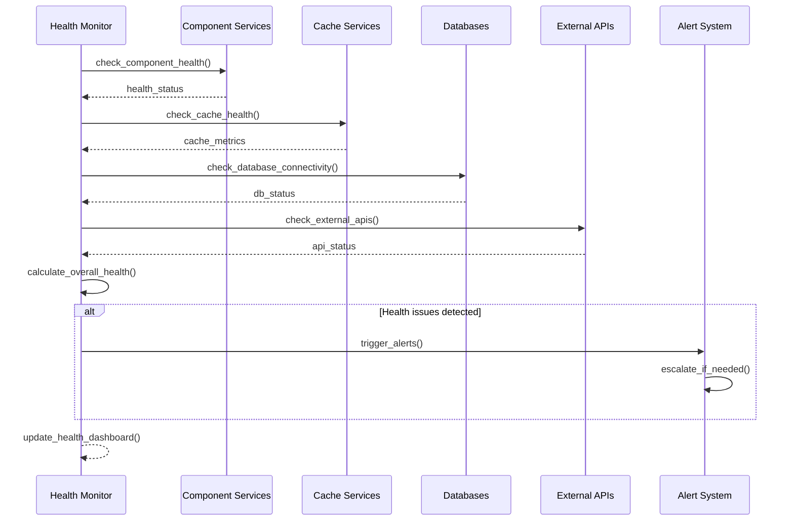

# Diagramas Arquiteturais - Resync HWA/TWS Integration

## Diagrama de Fluxo de Arquitetura

Este diagrama mostra o fluxo de dados e interações entre os principais componentes do sistema Resync:

### Legenda do Diagrama de Fluxo:
- **User Interface**: Interface web e mobile para usuários
- **FastAPI Gateway**: Gateway principal de API com middleware
- **WebSocket Handler**: Gerenciador de conexões WebSocket em tempo real
- **Authentication**: Serviço de autenticação JWT
- **Rate Limiting**: Controle de taxa baseado em Redis
- **Agent Manager**: Gestor central de agentes de IA
- **LLM Service**: Serviço de integração com modelos de linguagem
- **RAG Service**: Serviço de Retrieval-Augmented Generation
- **TWS Client**: Cliente para integração com HCL Workload Automation
- **Cache Hierarchy**: Sistema de cache multi-nível (L1/L2)
- **Circuit Breaker**: Padrão de resiliência para proteção contra falhas
- **Health Monitor**: Sistema de monitoramento de saúde
- **Audit Trail**: Sistema de auditoria criptografada
- **Encryption Service**: Serviço de criptografia de dados

## Diagrama de Organização em Camadas

Este diagrama mostra a arquitetura em camadas do sistema, organizada por responsabilidades:

### Descrição das Camadas:

#### 1. Presentation Layer (Camada de Apresentação)
- **Web Dashboard**: Interface administrativa baseada em React
- **Chat Interface**: Interface de chat em tempo real via WebSocket
- **REST API**: Endpoints RESTful baseados em FastAPI
- **WebSocket API**: API para comunicação em tempo real

#### 2. Gateway & Security Layer (Camada de Gateway e Segurança)
- **Authentication Service**: Autenticação baseada em JWT
- **Rate Limiting**: Controle de taxa com backend Redis
- **CSP Middleware**: Content Security Policy para segurança
- **CORS Management**: Gerenciamento de recursos cross-origin

#### 3. Business Logic Layer (Camada de Lógica de Negócio)
- **Agent Manager**: Gerenciamento do ciclo de vida de agentes IA
- **LLM Service**: Integração com modelos de linguagem
- **RAG Service**: Geração aumentada por recuperação
- **TWS Integration**: Cliente para HCL Workload Automation

#### 4. Data & Caching Layer (Camada de Dados e Cache)
- **Cache Hierarchy**: Sistema de cache L1/L2
- **Redis Cluster**: Cache distribuído
- **Neo4j Graph DB**: Armazenamento de knowledge graph
- **Vector Database**: Armazenamento de embeddings e similaridade

#### 5. Infrastructure & Monitoring (Infraestrutura e Monitoramento)
- **Health Monitoring**: Health checks comprehensivos
- **Circuit Breakers**: Padrões de resiliência
- **Performance Optimizer**: Auto-tuning e otimização
- **Audit Trail**: Logging de auditoria criptografado

#### 6. External Integrations (Integrações Externas)
- **NVIDIA LLM API**: Provider principal de modelos IA
- **OpenAI API**: Provider alternativo de LLM
- **TWS/HCL System**: Sistema de workload automation
- **RAG Microservice**: Serviço de processamento de documentos

## Diagrama de Deployment

Este diagrama mostra como os componentes são implantados em ambiente de produção:

### Arquitetura de Deployment:

#### Load Balancer (Balanceador de Carga)
- **NGINX/Traefik**: Proxy reverso com terminação SSL
- **Path Routing**: Roteamento baseado em caminhos
- **Health Checks**: Verificações de saúde dos serviços

#### Application Layer (Camada de Aplicação)
- **FastAPI Instances**: Múltiplas instâncias para escalabilidade
- **WebSocket Servers**: Servidores dedicados para comunicação real-time

#### Cache Layer (Camada de Cache)
- **Redis Cluster**: Cache distribuído com alta disponibilidade
- **In-Memory Cache**: Cache L1 por instância para performance

#### Database Layer (Camada de Banco de Dados)
- **Neo4j Cluster**: Cluster de graph database com réplicas
- **Vector Database**: Banco de dados vetorial para RAG

#### External Services (Serviços Externos)
- **AI Services**: APIs de modelos de linguagem
- **Enterprise Systems**: Sistemas corporativos integrados

#### Monitoring & Observability (Monitoramento e Observabilidade)
- **Prometheus**: Coleta de métricas e alerting
- **Logging**: Stack ELK para logs estruturados
- **Health Monitoring**: Monitoramento contínuo de componentes

## Fluxos de Execução Detalhados

### 1. Fluxo de Chat/TWS Integration

### 2. Fluxo de RAG Processing

### 3. Fluxo de Health Monitoring

## Padrões Arquiteturais Implementados

### 1. Microservices Pattern
- **Componentes desacoplados** com responsabilidades específicas
- **Comunicação via APIs** REST e WebSocket
- **Independência de deploy** e escalabilidade

### 2. Circuit Breaker Pattern
- **Proteção contra falhas em cascata**
- **Recuperação automática** com exponential backoff
- **Monitoramento de saúde** de serviços externos

### 3. CQRS (Command Query Responsibility Segregation)
- **Separação entre leitura e escrita**
- **Otimização independente** para cada operação
- **Escalabilidade direcionada**

### 4. Event-Driven Architecture
- **Comunicação assíncrona** entre componentes
- **Event sourcing** para auditoria
- **Desacoplamento temporal**

### 5. Cache-Aside Pattern
- **Cache multi-nível** para performance
- **Invalidação inteligente** de cache
- **Consistência eventual**

## Métricas de Performance e Disponibilidade

### KPIs de Performance
- **Response Time**: <200ms (P95)
- **Cache Hit Rate**: >90%
- **Throughput**: >1000 RPS
- **Memory Usage**: <512MB por instância
- **CPU Usage**: <70% em carga normal

### KPIs de Disponibilidade
- **Uptime**: 99.9%
- **MTTR (Mean Time to Recovery)**: <5 minutos
- **Error Rate**: <0.1%
- **Circuit Breaker Trips**: <1/hora
- **Health Check Failures**: <0.01%

### KPIs de Escalabilidade
- **Horizontal Scaling**: Suportado via Redis
- **Auto-scaling**: Baseado em métricas de carga
- **Load Balancing**: Distribuição uniforme de requests
- **Resource Efficiency**: >80% utilização ótima

## Considerações de Segurança

### 1. Authentication & Authorization
- **JWT tokens** com expiração configurável
- **Multi-factor authentication** suportado
- **Role-based access control** (RBAC)
- **Session management** seguro

### 2. Data Protection
- **AES-256 encryption** para dados sensíveis
- **TLS 1.3** para comunicação em trânsito
- **Data masking** em logs e monitoramento
- **Key rotation** automática

### 3. Network Security
- **CSP headers** com nonce support
- **Rate limiting** distribuído
- **Input validation** comprehensiva
- **SQL injection** prevention

### 4. Compliance & Audit
- **GDPR compliance** features
- **SOX compliance** ready
- **Immutable audit trails**
- **Forensic capabilities**

## Conclusão

Os diagramas apresentados demonstram uma arquitetura **extremamente madura e sofisticada** que implementa:

- **Design patterns modernos** consistentemente
- **Resiliência distribuída** comprehensiva
- **Performance optimization** avançada
- **Security-first approach** robusto
- **Observabilidade completa**
- **Scalability ready** design

A arquitetura do Resync representa um **exemplo excelente** de engenharia de software enterprise-ready, com atenção excepcional a detalhes técnicos, segurança, performance e operabilidade.
