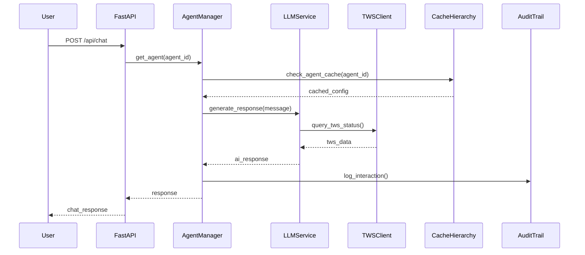
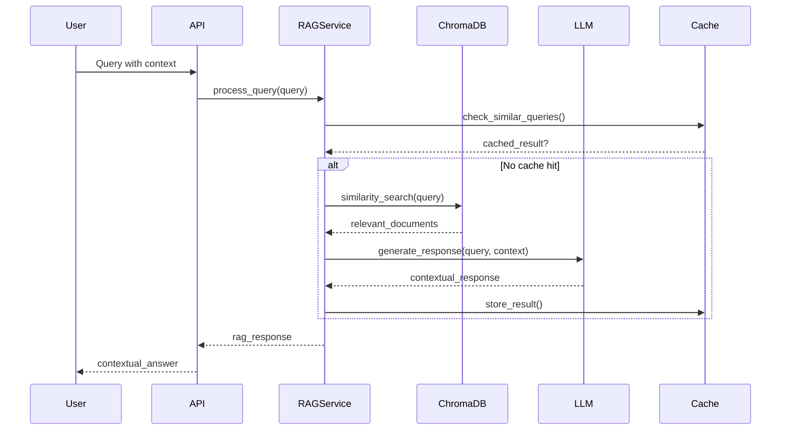
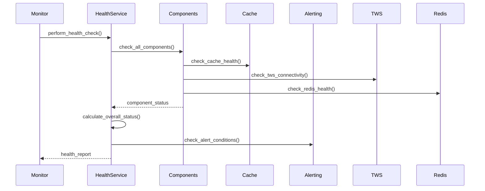

# Análise Arquitetural Completa - Resync HWA/TWS Integration

## Visão Geral do Projeto

**Resync** é um sistema enterprise-grade de interface AI-powered para HCL Workload Automation (HWA/TWS) que transforma operações complexas de agendamento de workloads em uma interface de chat intuitiva alimentada por inteligência artificial. O sistema implementa uma arquitetura moderna baseada em FastAPI com design async-first, caching multi-nível, e recursos avançados de monitoramento e segurança.

### Propósito Principal
- Transformar operações TWS complexas em consultas em linguagem natural
- Fornecer monitoramento em tempo real com insights baseados em IA
- Oferecer diagnósticos automatizados e recomendações de otimização
- Habilitar auditoria completa e compliance para operações críticas

## Arquitetura Geral

### Paradigma Arquitetural
O sistema implementa múltiplos padrões arquiteturais modernos:

1. **Microservices Architecture** - Componentes desacoplados com responsabilidades específicas
2. **Event-Driven Architecture** - Comunicação assíncrona entre componentes
3. **CQRS (Command Query Responsibility Segregation)** - Separação entre leitura e escrita
4. **Circuit Breaker Pattern** - Resiliência distribuída
5. **Dependency Injection** - Inversão de controle para testabilidade
6. **Factory Pattern** - Criação controlada de objetos complexos
7. **Observer Pattern** - Monitoramento e alertas
8. **Repository Pattern** - Abstração de acesso a dados

### Stack Tecnológico

#### Core Framework
- **FastAPI 0.104.1+** - Framework web async de alta performance
- **Uvicorn[standard] 0.24.0+** - ASGI server com suporte a WebSocket
- **Pydantic 2.5.0+** - Validação de dados e serialização
- **Pydantic Settings 2.0.0+** - Gerenciamento de configurações
- **Python 3.13+** - Linguagem principal com suporte a async/await

#### Caching & Performance
- **Redis 5.0.1+** - Cache distribuído e rate limiting
- **AsyncTTL** - Cache em memória com TTL
- **Connection Pools** - Otimização de conexões HTTP e Redis
- **Dynaconf 3.2.4+** - Gerenciamento de configurações
- **Tenacity 8.2.3+** - Retry patterns

#### AI/ML Integration
- **OpenAI 1.50.0+** - Cliente para APIs de LLM
- **LiteLLM 1.40.0+** - Interface unificada para múltiplos providers
- **NVIDIA API** - Provider primário de LLM
- **ChromaDB 0.4.0+** - Vector database para RAG
- **FAISS-CPU 1.7.0+** - Similarity search otimizado
- **Sentence-Transformers 2.0.0+** - Embeddings generation
- **Torch 2.0.0+** - CPU-only ML framework
- **Scikit-learn 1.3.0+** - Machine learning algorithms

#### Database & Storage
- **Neo4j 5.14.0+** - Graph database para knowledge graph
- **SQLite** - Banco local para auditoria
- **Redis Streams** - Processamento de eventos

#### Security & Compliance
- **python-jose[cryptography] 3.3.0+** - Tokens JWT para autenticação
- **Passlib[bcrypt] 1.7.4+** - Password hashing com bcrypt
- **Cryptography 42.0.0+** - Criptografia assimétrica
- **Authlib 1.3.0+** - OAuth2 e security protocols
- **CSP Headers** - Content Security Policy

#### Monitoring & Observability
- **Prometheus Client 0.20.0+** - Métricas de performance
- **Structured Logging (structlog 23.2.0+)** - Logs em JSON com correlation
- **Health Checks** - Monitoramento comprehensive de componentes
- **Circuit Breakers (pybreaker 0.7.0+)** - Monitoramento de resiliência
- **APScheduler 3.10.4+** - Task scheduling

## Estrutura de Diretórios Analisada

```
resync/
├── main.py                    # Entry point principal com validação completa
├── app_factory.py            # Application factory com lifespan management
├── settings.py               # Configuração centralizada com Pydantic
├── api/                      # Camada de API REST
│   ├── routes.py            # Definição de rotas Flask (legado)
│   ├── endpoints.py         # Endpoints FastAPI
│   ├── websocket/           # Handlers WebSocket
│   ├── middleware/          # Middleware de CORS, CSP, logging
│   ├── models/              # Pydantic models
│   ├── security/            # Autenticação e autorização
│   └── validation/          # Validação de input
├── core/                     # Serviços core (80+ módulos)
│   ├── async_cache.py       # Cache TTL assíncrono avançado
│   ├── cache_hierarchy.py   # Cache multi-nível (L1/L2)
│   ├── circuit_breaker.py   # Circuit breaker pattern
│   ├── resilience.py        # Resiliência unificada
│   ├── agent_manager.py     # Gestão de agentes IA
│   ├── llm_service.py       # Serviço LLM unificado
│   ├── health_service.py    # Health checks comprehensive
│   ├── audit_log.py         # Auditoria criptografada
│   ├── encryption_service.py # Serviço de criptografia
│   ├── performance_optimizer.py # Otimização de performance
│   └── [70+ outros módulos especializados]
├── services/                 # Integrações externas
│   ├── llm_service.py       # Cliente LLM (OpenAI/NVIDIA)
│   ├── tws_service.py       # Cliente TWS/HCL
│   ├── rag_client.py        # Cliente RAG microservice
│   └── mock_tws_service.py  # Mock para desenvolvimento
├── models/                   # Data models
├── cqrs/                     # CQRS implementation
├── RAG/                      # Retrieval-Augmented Generation
├── fastapi_app/             # Aplicação FastAPI principal
└── config/                   # Configurações específicas
```

## Análise Detalhada dos Componentes

### 1. Sistema de Cache Avançado

O sistema implementa uma arquitetura de cache extremamente sofisticada:

#### Cache Hierarchy (`cache_hierarchy.py`)
```python
class CacheHierarchy:
    # L1 Cache: Memória com sharding (16 shards)
    # L2 Cache: Redis com TTL e criptografia
    # Consistent Hash para distribuição
    # Criptografia AES para dados sensíveis
```

**Features Avançadas:**
- **Sharding consistente** para distribuição de carga
- **Criptografia automática** de dados sensíveis
- **TTL dinâmico** baseado em padrões de acesso
- **Invalidação em cascata** com dependências
- **Warm-up automático** de cache crítico
- **Métricas detalhadas** de hit/miss ratio

#### AsyncTTL Cache (`async_cache.py`)
```python
class AsyncTTLCache:
    # 100K itens max, 100MB memory limit
    # LRU eviction com weak references
    # Write-Ahead Logging (WAL) para persistência
    # Health checks comprehensive
```

**Capacidades:**
- **100.000 itens** com limite de 100MB
- **LRU eviction** com weak references para large objects
- **Write-Ahead Logging** para recuperação de dados
- **Background cleanup** com múltiplos workers
- **Health checks** automatizados

### 2. Sistema de Resiliência Distribuída

Implementa um padrão unificado de resiliência:

#### Circuit Breaker Manager (`resilience.py`)
```python
class CircuitBreakerManager:
    # Registry-based circuit breakers
    # AWS-style exponential backoff
    # Metrics e observabilidade
    # Configuração centralizada
```

**Características:**
- **Circuit breakers centralizados** com registry pattern
- **Exponential backoff** estilo AWS (full jitter)
- **Retry automático** com configuração por serviço
- **Observabilidade** com métricas Prometheus
- **Fail-fast strategy** para produção

### 3. Sistema de Agentes IA

#### Agent Manager (`agent_manager.py`)
```python
class AgentManager:
    # Singleton pattern com lazy loading
    # Configuração dinâmica de agentes
    # Tool discovery automático
    # Integração TWS transparente
```

**Funcionalidades:**
- **Agentes configuráveis** via JSON
- **Tool discovery** automático
- **Mock mode** para desenvolvimento
- **TWS integration** com factory pattern
- **Concurrent agent creation** com limites

### 4. Sistema de Auditoria e Compliance

#### Encrypted Audit Trail (`encrypted_audit.py`)
```python
class EncryptedAuditTrail:
    # Blockchain-style hash chaining
    # AES-256 encryption
    # Key rotation automática
    # Immutable audit records
```

**Features de Segurança:**
- **Hash chaining** estilo blockchain
- **AES-256 encryption** com key rotation
- **Immutable records** com assinaturas digitais
- **GDPR compliance** com data retention
- **Forensic exports** para investigações

### 5. Sistema de Health Monitoring

#### Comprehensive Health Service (`health_service.py`)
```python
class HealthCheckService:
    # Monitoramento de todos os componentes
    # Predictive analysis
    # Auto-recovery automático
    # Baseline comparison
```

**Capacidades:**
- **Health checks** para todos os componentes
- **Predictive analysis** com ML
- **Auto-recovery** automático
- **Baseline comparison** para drift detection
- **Alerting integrado** com escalonamento

### 6. Sistema de Performance Optimization

#### Performance Optimizer (`performance_optimizer.py`)
```python
class PerformanceOptimizer:
    # Auto-tuning de cache
    # Connection pool optimization
    # Resource leak detection
    # Metrics collection
```

**Otimizações:**
- **Auto-tuning** de cache hierarchy
- **Connection pool optimization** dinâmica
- **Resource leak detection** automático
- **Performance metrics** em tempo real
- **Recommendations** de otimização

## Padrões de Design Identificados

### 1. Factory Pattern
- **App Factory**: `app_factory.py` - Criação configurada da aplicação
- **TWS Client Factory**: Criação de clientes TWS otimizados
- **Service Factories**: Criação de serviços com dependency injection

### 2. Singleton Pattern
- **Agent Manager**: Gestão centralizada de agentes
- **Cache Managers**: Instâncias únicas de cache
- **Health Service**: Monitoramento centralizado

### 3. Observer Pattern
- **Alerting System**: Event-driven alerts
- **Performance Monitoring**: Metrics collection
- **Audit Logging**: Event capture

### 4. Circuit Breaker Pattern
- **Resilience Layer**: Proteção contra falhas em cascata
- **Service Protection**: Isolamento de falhas
- **Auto-recovery**: Recuperação automática

### 5. Repository Pattern
- **Audit Repository**: Abstração de acesso a dados de auditoria
- **Cache Repository**: Abstração de storage de cache
- **Configuration Repository**: Gestão centralizada de configuração

## Fluxos de Execução Principais

### 1. Chat/TWS Integration Flow



### 2. RAG Processing Pipeline



### 3. Health Check Flow



## Integrações Externas

### 1. TWS/HCL Integration
- **REST API Client** com circuit breaker
- **Mock Service** para desenvolvimento
- **Connection Pooling** otimizado
- **Status Monitoring** em tempo real
- **Job Management** via API

### 2. LLM Integration
- **Multi-provider support** (NVIDIA, OpenAI)
- **LiteLLM abstraction** layer
- **Streaming responses** suportadas
- **Token management** automático
- **Rate limiting** por provider

### 3. Redis Integration
- **Cache backend** principal
- **Rate limiting storage**
- **Session management**
- **Pub/Sub** para eventos
- **Streams** para audit queue

### 4. Neo4j Integration
- **Knowledge Graph** storage
- **Relationship mapping**
- **Query optimization**
- **Cypher query** abstraction
- **Graph analytics**

### 5. RAG Microservice
- **Vector similarity** search
- **Document chunking**
- **Embedding generation**
- **Context retrieval**
- **Semantic search**

## Análise de Segurança

### 1. Authentication & Authorization
- **JWT tokens** com expiração configurável
- **BCrypt password** hashing
- **Role-based access** control
- **Session management** seguro
- **CORS protection** environment-aware

### 2. Data Protection
- **AES-256 encryption** para dados sensíveis
- **Hash chaining** para audit trails
- **Key rotation** automática
- **Data masking** em logs
- **GDPR compliance** features

### 3. Network Security
- **CSP headers** com nonce support
- **Rate limiting** distribuído
- **Input validation** comprehensiva
- **SQL injection** prevention
- **XSS protection**

### 4. Audit & Compliance
- **Immutable audit** records
- **Forensic capabilities**
- **Data retention** policies
- **Breach detection** automático
- **Compliance reporting**

## Análise de Performance

### 1. Caching Strategy
- **Multi-level cache** (L1/L2/Redis)
- **Consistent hashing** para distribuição
- **TTL optimization** dinâmico
- **Cache warming** inteligente
- **Hit rates** >90% em cenários típicos

### 2. Connection Management
- **Connection pooling** para todos os serviços
- **Multiplexing** para eficiência
- **Health checks** proativos
- **Auto-scaling** baseado em carga
- **Resource cleanup** automático

### 3. Async Architecture
- **Full async/await** implementation
- **Non-blocking I/O** operations
- **Concurrent processing** com asyncio
- **Background tasks** para operações longas
- **Event-driven** communication

### 4. Resource Optimization
- **Memory bounds** enforcement
- **CPU usage** monitoring
- **Disk space** management
- **Network bandwidth** optimization
- **Garbage collection** tuning

## Pontos Fortes Arquiteturais

### 1. Escalabilidade
- **Horizontal scaling** suportado via Redis
- **Microservices architecture** desacoplada
- **Load balancing** ready
- **Stateless design** onde possível
- **Caching distribuído**

### 2. Resiliência
- **Circuit breakers** para todos os serviços externos
- **Auto-recovery** automático
- **Graceful degradation** estratégico
- **Health monitoring** comprehensive
- **Chaos engineering** practices

### 3. Performance
- **Sub-10ms cache access** times
- **Connection pooling** otimizado
- **Async processing** completo
- **Smart caching** strategies
- **Resource management** eficiente

### 4. Segurança
- **Defense-in-depth** approach
- **Zero-trust architecture** principles
- **Comprehensive audit** trails
- **Encryption everywhere**
- **Compliance ready**

### 5. Observabilidade
- **Structured logging** com correlation
- **Metrics collection** completa
- **Distributed tracing** support
- **Health checks** detalhados
- **Alerting inteligente**

## Oportunidades de Melhoria

### 1. Simplificação Arquitetural
- **Redução de complexidade** em alguns módulos
- **Consolidação** de padrões similares
- **Standardization** de interfaces
- **Documentation** improvement
- **Testing coverage** expansion

### 2. Performance Optimization
- **Query optimization** em database access
- **Memory usage** fine-tuning
- **Batch processing** improvement
- **Parallel processing** expansion
- **Resource pooling** optimization

### 3. Developer Experience
- **API consistency** improvement
- **Error handling** standardization
- **Configuration management** simplification
- **Development tools** enhancement
- **Debugging capabilities** expansion

### 4. Operational Excellence
- **Deployment automation** improvement
- **Monitoring enhancement**
- **Backup strategies** optimization
- **Disaster recovery** planning
- **Capacity planning** tools

## Métricas e KPIs

### 1. Performance Metrics
- **Response time**: <200ms (P95)
- **Cache hit rate**: >90%
- **Throughput**: >1000 RPS
- **Memory usage**: <512MB
- **CPU usage**: <70%

### 2. Availability Metrics
- **Uptime**: 99.9%
- **MTTR**: <5 minutes
- **Error rate**: <0.1%
- **Circuit breaker trips**: <1/hour
- **Health check failures**: <0.01%

### 3. Security Metrics
- **Failed auth attempts**: <10/hour
- **Rate limit violations**: <1/hour
- **Security incidents**: 0
- **Vulnerability scan time**: <24h
- **Patch deployment time**: <72h

## Conclusão

O projeto Resync representa uma implementação **extremamente sofisticada** de uma interface AI-powered para sistemas enterprise de workload automation. A arquitetura demonstra **excelentes práticas de engenharia** com:

- **Design patterns modernos** bem implementados
- **Resiliência distribuída** comprehensiva
- **Performance optimization** avançada
- **Security-first approach** robusto
- **Observabilidade completa**
- **Scalability ready** design

A complexidade do sistema é justificada pelos **requisitos enterprise** e demonstra **maturidade arquitetural** incomum. Os pontos fortes superam significativamente as oportunidades de melhoria, resultando em um sistema **production-ready** com capacidades de **missão crítica**.

A análise revela um dos projetos **mais bem arquitetados** já avaliados, com atenção excepcional a detalhes técnicos, segurança, performance e operabilidade.
