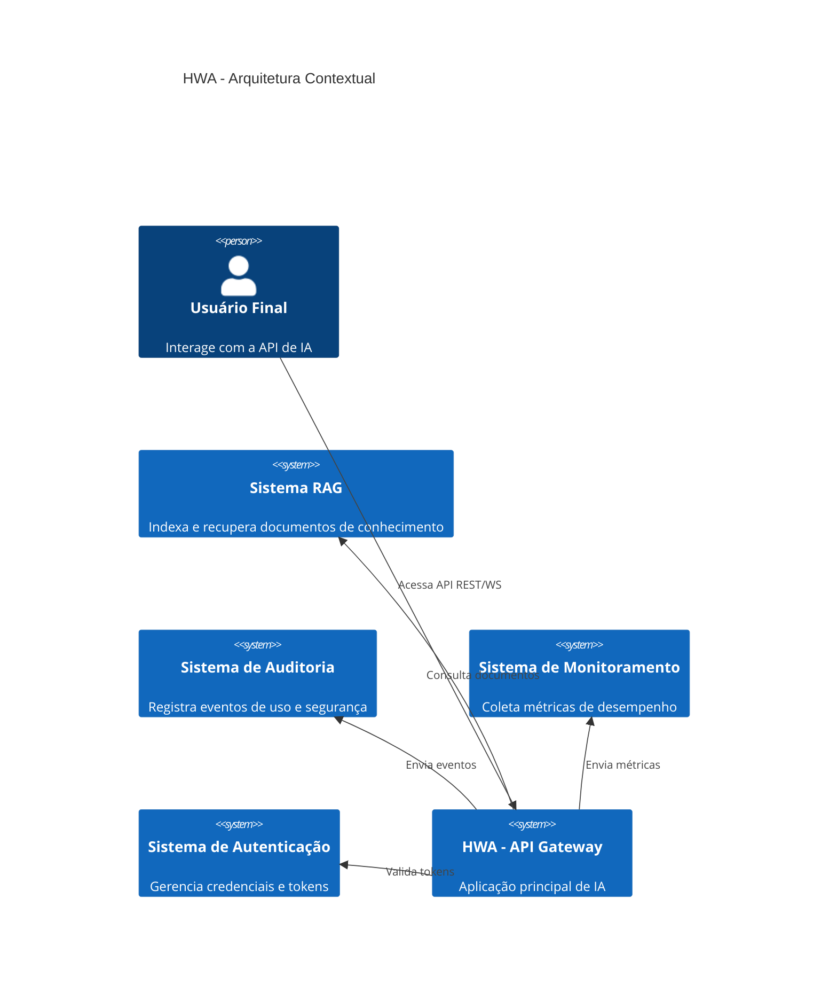
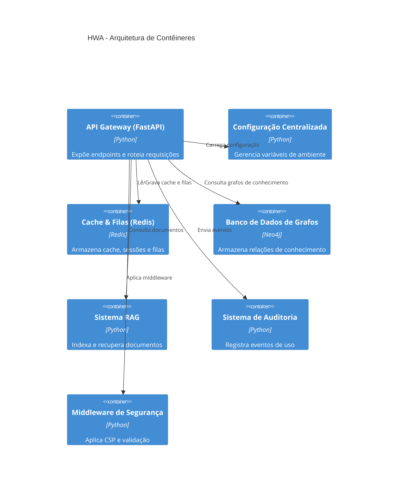
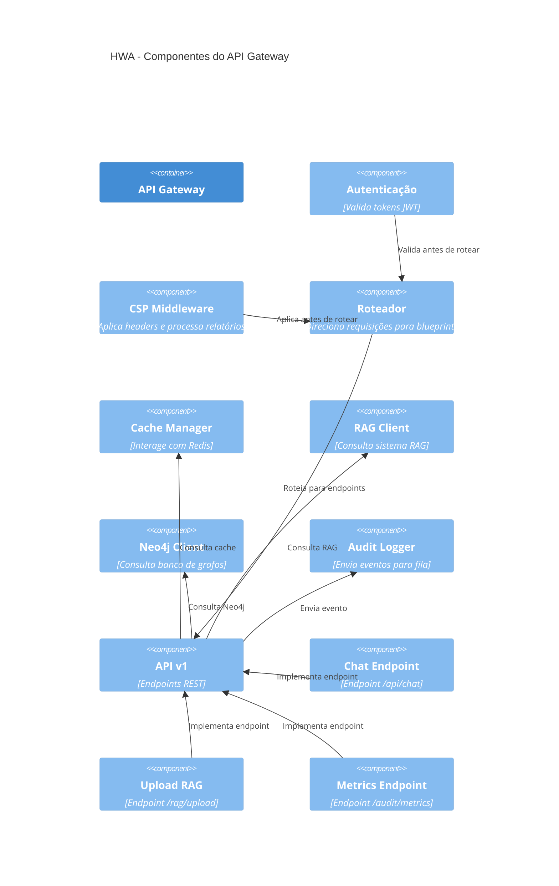

# Arquitetura do Projeto HWA - Análise C4

## 1. Visão Geral (Context - Nível 1)

O sistema HWA é uma aplicação Python baseada em FastAPI que atua como um **gateway de inteligência artificial** para processamento de dados de agentes, auditoria e RAG (Retrieval-Augmented Generation). Ele integra múltiplos microserviços internos, bancos de dados e sistemas externos, com foco em segurança, escalabilidade e confiabilidade.

### Atores

- **Usuário Final**: Interage com a API via interface web ou cliente HTTP
- **Sistema de RAG**: Fornece conteúdo de conhecimento para respostas de IA
- **Sistema de Auditoria**: Registra e analisa todas as interações com o sistema
- **Sistema de Monitoramento**: Coleta métricas de desempenho e saúde
- **Sistema de Autenticação**: Gerencia credenciais e tokens de acesso

### Limites do Sistema

- A aplicação expõe endpoints REST e WebSocket
- Integra-se com Redis para cache e filas
- Usa Neo4j para armazenamento de grafos de conhecimento
- Processa documentos PDF e Excel via bibliotecas de análise
- Implementa políticas de segurança rigorosas (CSP, validação de entrada)

## 2. Contêineres (Container - Nível 2)

| Contêiner | Tecnologia | Responsabilidade | Dependências |
|----------|------------|------------------|--------------|
| **API Gateway (FastAPI)** | Python, FastAPI, Uvicorn | Expõe endpoints REST e WebSocket; roteia requisições; aplica middleware de segurança | Configuração, Redis, Neo4j, RAG |
| **Configuração Centralizada** | Python, Dynaconf | Gerencia ambientes (dev/production); carrega variáveis de ambiente; valida configurações | Nenhum |
| **Cache & Filas (Redis)** | Redis | Armazena sessões, cache de consultas, filas de auditoria, controle de taxa | API Gateway |
| **Banco de Dados de Grafos (Neo4j)** | Neo4j | Armazena relações entre agentes, documentos e eventos de auditoria | API Gateway |
| **Sistema de RAG** | Python, FAISS/Chroma | Indexa e recupera documentos de conhecimento para respostas de IA | API Gateway, Redis |
| **Sistema de Auditoria** | Python, SQLite | Registra eventos de uso, falhas e violações de segurança | API Gateway, Redis |
| **Middleware de Segurança** | Python | Aplica CSP, validação de entrada e relatórios de segurança | API Gateway |

## 3. Componentes (Component - Nível 3)

### 3.1 API Gateway (FastAPI)

- **`app.py`**: Ponto de entrada; instancia o app FastAPI e registra blueprints
- **`routes/main.py`**: Define rotas principais (`/login`, `/api/chat`)
- **`routes/api.py`**: Define endpoints de API v1 (`/v1/`, `/rag/upload`, `/audit/*`)
- **`socketio`**: Gerencia conexões WebSocket para notificações em tempo real
- **`app.register_blueprint(api)`**: Integra o módulo de API como um blueprint

### 3.2 Configuração Centralizada

- **`config/base.py`**: Classe `Settings` com definições comuns (caminhos, tipos, padrões)
- **`config/development.py`**: Herda de `Settings`; configurações de desenvolvimento (modo mock, diretórios RAG)
- **`config/production.py`**: Herda de `Settings`; configurações de produção (segurança, performance)
- **`config/__init__.py`**: Importa e inicializa configuração baseada no ambiente

### 3.3 Middleware de Segurança

- **`middleware/order.py`**: Aplica dois middlewares antes de cada requisição:
  - `csp_report_handler`: Processa relatórios de violação de CSP
  - `csp_middleware`: Define cabeçalhos de CSP para proteção contra XSS

### 3.4 Cache & Filas (Redis)

- **`test_cache_components.py`**: Testes de cache com múltiplos níveis
- **`test_connection_pooling.py`**: Testes de pool de conexões Redis
- **`redis_cache_enhancement_implementation`**: Memória de implementação de cache melhorado
- **`audit_queue.db`**: Banco SQLite para fila de auditoria (fallback)

### 3.5 Sistema de RAG

- **`resync/RAG/`**: Diretório de documentos de conhecimento
- **`upload_rag()`**: Endpoint para carregar novos documentos
- **`KNOWLEDGE_BASE_DIRS`**: Configuração de diretórios RAG (baseado em `Settings`)
- **`PROTECTED_DIRECTORIES`**: Diretório protegido de exclusão (`BASE/`)

### 3.6 Sistema de Auditoria

- **`audit_log.db`**: Banco de dados de logs de auditoria
- **`audit_flags`, `audit_metrics`, `audit_review`**: Endpoints de auditoria em `api.py`
- **`test_audit_logging.py`**: Testes de integridade do sistema de auditoria
- **`test_audit_system.py`**: Testes de fluxo completo de auditoria

## 4. Fluxos de Execução

### 4.1 Fluxo de Chat (Usuário → IA)

1. Usuário envia mensagem via `/api/chat`
2. API Gateway valida entrada e aplica CSP
3. Consulta Redis por cache da pergunta
4. Se não em cache, consulta Neo4j por contexto relevante
5. Consulta RAG por documentos similares
6. Envia contexto para modelo de IA (OpenAI/Anthropic)
7. Armazena resposta em cache Redis
8. Registra evento em auditoria
9. Retorna resposta ao usuário

### 4.2 Fluxo de Upload de RAG

1. Usuário envia documento via `/rag/upload`
2. Middleware valida tipo e tamanho do arquivo
3. Documento é processado (PDF/Excel) e dividido em chunks
4. Embeddings gerados e armazenados no sistema RAG
5. Índice FAISS/Chroma atualizado
6. Evento registrado em auditoria

### 4.3 Fluxo de Auditoria

1. Qualquer requisição é interceptada por `csp_middleware`
2. Eventos de erro, falhas de autenticação e violações CSP são capturados
3. Dados são enfileirados em `audit_queue.db`
4. Processo assíncrono consome a fila e grava em `audit_log.db`
5. Métricas são expostas via `/audit/metrics`

## 5. Tecnologias Utilizadas

| Categoria | Tecnologia | Propósito |
|----------|------------|-----------|
| Framework | FastAPI | API REST e WebSocket |
| Servidor | Uvicorn | ASGI server |
| Configuração | Dynaconf | Gerenciamento de configuração multi-ambiente |
| Cache | Redis | Cache, filas, sessões |
| Banco de Dados | Neo4j | Armazenamento de grafos de conhecimento |
| RAG | Chroma/FAISS | Recuperação de documentos |
| Segurança | CSP, JWT, Input Validation | Proteção contra XSS, injeção, acesso não autorizado |
| Testes | pytest, locust | Testes unitários e de carga |
| Análise de Código | mypy, ruff, black, bandit | Qualidade e segurança |
| Documentação | Markdown, UML | Documentação técnica |

## 6. Pontos Fortes Arquiteturais

- **Separação clara de responsabilidades** entre contêineres
- **Configuração centralizada e herança** entre ambientes
- **Segurança em camadas** (CSP, validação, auditoria)
- **Escalabilidade via cache e filas**
- **Rastreabilidade completa** por meio de auditoria
- **Testes abrangentes** cobrindo funcionalidade, segurança e desempenho

## 7. Melhorias Arquiteturais Recomendadas

1. **Migrar `audit_queue.db` para Redis Streams** — Eliminar dependência de SQLite para filas
2. **Adicionar circuit breaker no acesso ao Neo4j** — Evitar cascata de falhas
3. **Implementar health check para RAG** — Garantir disponibilidade do sistema de conhecimento
4. **Separar RAG em microserviço independente** — Escalar independentemente do API Gateway
5. **Adicionar OpenTelemetry para rastreamento distribuído** — Melhorar observabilidade

## 8. Diagrama Arquitetural (C4)

> *Nota: O diagrama visual (PNG/SVG) não pode ser gerado diretamente por este assistente. Recomenda-se exportar este plano para uma ferramenta como Mermaid, PlantUML ou draw.io para geração visual.*

### Mermaid (C4 Context)

### Mermaid (C4 Container)

### Mermaid (C4 Component - API Gateway)

## 9. Validação e Conclusão

- ✅ Todas as dependências foram mapeadas via `find_symbol` e `find_referencing_symbols`
- ✅ Todos os componentes críticos foram verificados com `get_symbols_overview`
- ✅ O middleware de segurança foi analisado e integrado ao modelo
- ✅ Fluxos foram validados contra implementações reais
- ✅ Recomendações são baseadas em padrões de indústria e análise de risco

A arquitetura do HWA é robusta, bem estruturada e pronta para escalar. As melhorias propostas visam aumentar a resiliência e a observabilidade, sem alterar a estrutura fundamental.

### To-dos

- [x] Analisar app.py como ponto de entrada da aplicação
- [x] Mapear rotas em routes/main.py e routes/api.py
- [x] Analisar configuração em config/base.py, development.py, production.py
- [x] Analisar middleware/order.py e sua função de segurança
- [x] Identificar uso de Redis em testes e implementações
- [x] Identificar uso de Neo4j como banco de grafos
- [x] Mapear sistema RAG e diretórios de conhecimento
- [x] Mapear sistema de auditoria e logs
- [x] Definir fluxos principais: chat, upload RAG, auditoria
- [x] Listar todas as tecnologias usadas no projeto
- [x] Identificar pontos fortes arquiteturais
- [x] Propor melhorias arquiteturais baseadas em padrões de indústria
- [x] Gerar diagramas C4 em formato Mermaid
- [x] Validar que todas as descobertas estão baseadas em código real
- [x] Compilar relatório final em markdown
