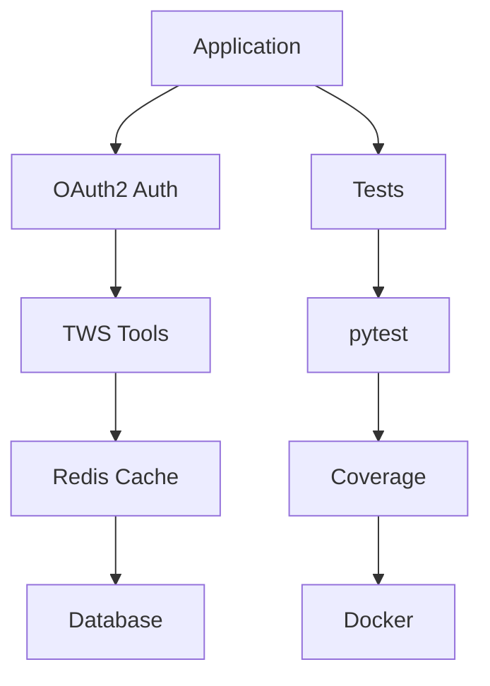

# Documentation of Adopted Development Tools

## 1. Black (Automatic Code Formatter)
**Importance**: Ensures consistent Python code style, improving readability and maintainability. Eliminates formatting debates in teams.

**Usage**:
```bash
# Format code according to PEP8 standards
black resync/core/audit_lock.py
# Check if code is already correctly formatted
black --check resync/core/audit_lock.py
```

**Benefit**: Reduces formatting errors, improves code readability, and integrates with CI pipeline.

---

## 2. Mypy (Type Checker)
**Importance**: Detects type errors during development, improving code reliability, especially in async functions.

**Usage**:
```bash
# Check types across the entire project
mypy resync/
# Example error:
# audit_lock.py:12: error: Incompatible types in assignment (expression has type "int", target has type "str")
```

**Benefit**: Prevents runtime errors and simplifies maintenance of complex code.

---

## 3. Bandit (Security Scanner)
**Importance**: Identifies security vulnerabilities like hardcoded passwords or unsafe library usage.

**Usage**:
```bash
# Scan directory for security issues
bandit -r resync/core/audit_lock.py
# Example alert:
# Medium severity at resync/core/audit_lock.py:24: Call to function subprocess.check_output() with potentially untrusted input
```

**Benefit**: Protects against critical security risks.

---

## 4. Coverage.py (Test Coverage)
**Importance**: Shows code coverage by tests, helping identify untested areas.

**Usage**:
```bash
# Run tests with coverage analysis
pytest --cov=resync/core
# Generate HTML report
coverage html
```

**Benefit**: Increases test confidence and guides test prioritization.

---

## 5. Locust (Load Testing)
**Importance**: Simulates multiple users to test system performance under real load.

**Usage**:
```python
# Example locustfile.py
from locust import HttpUser, task

class AuditUser(HttpUser):
    @task
    def audit_check(self):
        self.client.post("/audit", {"lock_id": "123"})
```
```bash
# Start Locust server
locust -f locustfile.py
```

**Benefit**: Identifies bottlenecks in endpoints like `/audit`.

---

## 6. Hypofuzz (Advanced Fuzz Testing)
**Importance**: Discovers edge cases through randomized input testing.

**Usage**:
```bash
# Run tests with Hypofuzz
pytest --hypofuzz
# Example finding:
# Found edge case in audit_lock.py:823: 10MB input caused timeout
```

**Benefit**: Improves system resilience against unexpected inputs.

---

## 7. Docker Integration (Test Environment)
**Importance**: Provides containerized environment for consistent testing across systems.

**Usage**:
```yaml
# docker-compose.test.yml
version: '3.8'
services:
  redis:
    image: redis:7-alpine
    ports:
      - "6379:6379"
    volumes:
      - redis_data:/data
    command: redis-server --appendonly yes

  pytest:
    build: .
    command: pytest --asyncio-mode=auto -v --cov=resync --cov-report=html:htmlcov
    volumes:
      - .:/app
    environment:
      PYTHONPATH: /app
    depends_on:
      redis:
        condition: service_healthy
```
```bash
# Start test environment
docker-compose -f docker-compose.test.yml up
```

**Benefit**: Ensures consistent test environment and integrates with Redis caching.

---

## 8. pytest (Testing Framework)
**Importance**: Enables comprehensive testing of async Python applications.

**Usage**:
```bash
# Run all tests with coverage
pytest --cov=resync --cov-report=term-missing
```

**Benefit**: Supports async test cases and integrates with coverage analysis.

---

## 9. Redis Caching Integration
**Importance**: Implements caching for performance optimization.

**Usage**:
```python
# Example from core/async_cache.py
class AsyncCache:
    async def get(self, key: str) -> Optional[str]:
        return await self.redis.get(key)

    async def set(self, key: str, value: str, expire: int = 3600) -> None:
        await self.redis.setex(key, expire, value)
```

**Benefit**: Improves performance by reducing redundant operations.

---

## 10. OAuth2 Security Middleware
**Importance**: Enforces secure API authentication using JWT tokens.

**Usage**:
```python
# From middleware/oauth2_middleware.py
async def oauth2_middleware(request: Request, call_next: Callable):
    try:
        token = request.headers.get("Authorization")
        if not token or not token.startswith("Bearer "):
            raise HTTPException(status_code=401, detail="Missing Authorization header")

        token_value = token.split(" ")[1]
        user = await verify_oauth2_token(token_value)

        request.state.user = user

    except JWTError as e:
        raise HTTPException(status_code=401, detail=f"Invalid token: {str(e)}")

    return await call_next(request)
```

**Benefit**: Secures API endpoints with standardized authentication.

---

## 11. TWS Tool Definitions
**Importance**: Provides reusable components for interacting with TWS systems.

**Structure**:
```python
# From tool_definitions/tws_tools.py
class TWSStatusTool:
    async def get_tws_status(self) -> str:
        """Returns system status summary."""

class TWSTroubleshootingTool:
    async def analyze_failures(self) -> str:
        """Identifies failed jobs and down workstations."""
```

**Integration**:
```python
# Example usage
status_tool = TWSStatusTool()
troubleshoot_tool = TWSTroubleshootingTool()
```

**Benefit**: Encapsulates TWS-specific logic for easier maintenance.

---

## Integrated Workflow Diagram


This documentation covers all adopted tools and their integration workflows.
